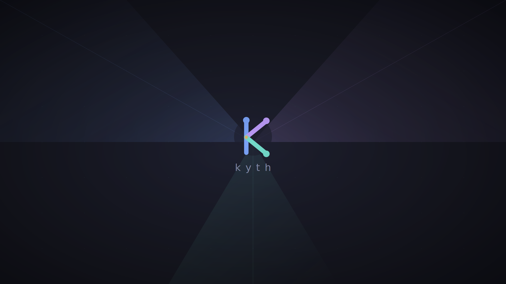
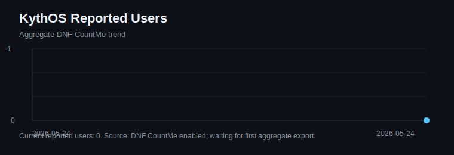

<div align="center">

# KythOS

### A friendly desktop OS for games, creative work, tinkering, and everyday life.

[Download Stable ISO](https://github.com/mrtrick37/kyth/releases/tag/iso-latest) |
[Try Testing ISO](https://github.com/mrtrick37/kyth/releases/tag/iso-testing) |
[Gaming Docs](docs/gaming-validation-matrix.md) |
[Report A Bug](https://github.com/mrtrick37/kyth/issues)



</div>

KythOS is a ready-to-install Linux desktop for people who want their games, tools, updates, and hardware setup to feel less fragile.

It starts from a live USB, installs with a real graphical installer, and opens into a polished KDE Plasma desktop with gaming tools, creator tools, driver helpers, update controls, and a first-run **System Hub** to help you settle in.

## Download

| Channel | Best for | Download |
|---|---|---|
| `latest` | Daily use | [Stable ISO release](https://github.com/mrtrick37/kyth/releases/tag/iso-latest) |
| `testing` | New features, active development, helping catch breakage | [Testing ISO release](https://github.com/mrtrick37/kyth/releases/tag/iso-testing) |

Direct downloads:

- [kyth-live-latest.iso](https://pub-9a3cc72972ea44c4ae7504ee7cda1fa6.r2.dev/kyth-live-latest.iso)
- [kyth-live-testing.iso](https://pub-9a3cc72972ea44c4ae7504ee7cda1fa6.r2.dev/kyth-live-testing.iso)

You will need at least 8 GB RAM for the live session, a USB drive, and an internet connection during install.

## Why Gamers Should Care

KythOS is not trying to pretend every game works on Linux. It is trying to make the games that can work feel easier to set up, easier to tune, and easier to recover from when launchers, drivers, shaders, mods, or anti-cheat updates decide to be difficult.

## What You Get On Day One

| Play | Tune | Mod | Stream | Recover |
|---|---|---|---|---|
| Steam, Lutris, Heroic, Proton tools, game helpers | MangoHud, vkBasalt, Gamescope presets, GameMode | Modding docs, save migration docs, Windows game-drive notes | OBS support, vkcapture, media codecs, low-latency audio | Staged updates, previous boot entries, repair tools, diagnostics |

## The KythOS Experience

**Boot the USB.** Try the desktop before touching your disk.

**Install with a real installer.** Choose erase-disk or install-alongside, create your user, and let KythOS write the system.

**Open System Hub.** First login walks you through updates, hardware checks, firmware, gaming setup, optional apps, VPN, cloud storage, repair tools, and extras.

**Start playing.** Install your launchers, pick your Proton runner, check your games, and use the helper tools when something needs a nudge.

## Built For Windows Gamers Who Are Linux-Curious

KythOS tries to make the first few hours less weird:

- A live desktop you can test from USB.
- A graphical installer instead of a pile of terminal steps.
- Steam, Lutris, Heroic, ProtonUp-Qt, and protontricks in the expected workflow.
- Game save backup and restore guidance through Ludusavi.
- Windows game-drive migration notes.
- ProtonDB and anti-cheat references where they belong.
- Non-destructive "fix my game" style checks in System Hub.
- No forced update reboot rhythm.

Some games will still be blocked by publisher anti-cheat choices. KythOS keeps that reality visible instead of burying it under hype.

## Built For Linux Gamers Who Like Control

KythOS also respects the people who already know what they want:

- GE-Proton is available, with update support.
- Gamescope presets make it easier to test frame limits, scaling, latency, VRR, MangoHud, vkBasalt, and HDR-related paths.
- MangoHud ships with a useful default overlay.
- vkBasalt is preconfigured for sharpening when enabled.
- GameMode can shift performance behavior while a game runs.
- sched-ext controls are available for scheduler experiments.
- NTSYNC support is wired for lower-latency Wine/Proton sync paths.
- Optional Mesa-git builds are supported for people chasing newer GPU stacks.

## System Hub

<div align="center">

</div>

System Hub is the KythOS control room. It keeps common setup and recovery work in one app so you do not have to remember where everything lives.

| Area | What it helps with |
|---|---|
| Home | First-run setup, branch selection, hardware check, firmware check, gaming setup |
| Updates | Stage system updates and see what is waiting for reboot |
| Hardware | GPU probe, device info, firmware and driver status |
| Gaming | Launchers, Proton tools, MangoHud, vkBasalt, save tools, migration helpers |
| Creator | OBS, Kdenlive, Audacity, GIMP, OpenDeck, DaVinci Resolve helper |
| Software | Flatpak apps, Homebrew, Distrobox, common installs |
| Network | VPN Connect, GlobalProtect SAML flow, SMB shares, rclone cloud storage |
| Security | Optional Kali toolbox containers, Wireshark, Burp Suite Community |
| Repair | SELinux relabel, Flatpak repair, diagnostics |

## Install

1. Flash the ISO with Balena Etcher, Ventoy, `dd`, or another USB writer.
2. Boot from the USB drive.
3. Click **Install KythOS** on the desktop.
4. Choose **Erase disk** or **Install alongside**.
5. Pick your disk, timezone, hostname, and user account.
6. Start the install and wait for the OS image to download.
7. Reboot, open System Hub, and finish setup.

## Gaming Reality Check

KythOS focuses on making Linux gaming smoother, not making impossible promises.

| Usually friendly | Needs checking | Often blocked |
|---|---|---|
| Steam games with Proton support, native Linux games, single-player titles, many co-op games | Games with external launchers, heavy modding, unusual codecs, or anti-cheat that changes policy | Games whose publishers block Wine/Proton or require Windows-only kernel anti-cheat |

Useful project docs:

- [Daily-driver validation](docs/daily-driver-validation.md)
- [Gaming validation matrix](docs/gaming-validation-matrix.md)
- [Gaming results](docs/gaming-results/)
- [Modding on KythOS](docs/modding-on-kythos.md)
- [Game save migration](docs/game-save-migration.md)
- [Developer Linux support checklist](docs/developer-linux-support-checklist.md)
- [Why this can work better here](docs/works-better-here.md)

## Creator And Daily Desktop Tools

KythOS is gaming-first, but not gaming-only.

- OBS Studio support with Vulkan/OpenGL capture paths.
- Kdenlive, Audacity, GIMP, OpenDeck, and DaVinci Resolve helper workflows.
- Full media codec stack for playback, editing, and thumbnails.
- PipeWire tuned for low-latency audio.
- Brave, VS Code, GitHub CLI, Docker, Homebrew, Distrobox, QEMU/libvirt, Incus/LXC, and KDE Connect.
- Standalone VPN Connect app with GlobalProtect SAML support.
- Optional Kali Linux toolbox for security work without stuffing the base OS full of tools.

---

## User Count

KythOS enables DNF CountMe in the image so aggregate repository metadata requests
can estimate active installs without account tracking or per-machine IDs.



The graph is generated from [`docs/metrics/kythos-users.csv`](docs/metrics/kythos-users.csv).
CountMe has just been enabled for KythOS, so the checked-in graph starts at zero
until the first aggregate export is available.

---

## Technical Details

This is the part for builders, testers, and people who want to know exactly what is inside the image.

[](https://github.com/mrtrick37/kyth/actions/workflows/build.yml)
[](https://github.com/mrtrick37/kyth/actions/workflows/build-live-iso.yml)
[](https://github.com/mrtrick37/kyth/pkgs/container/kyth)
[](https://fedoraproject.org/atomic-desktops/kinoite/)
[](https://containers.github.io/bootc/)

### Current Project State

KythOS is actively developed on the `testing` branch, with `latest` used as the daily-use channel and `testing` used for ISO, installer, live-session, Secure Boot, and hardware-support work before it is promoted.

The current tree builds:

- A bootc OS image published as `ghcr.io/mrtrick37/kyth:latest` and `ghcr.io/mrtrick37/kyth:testing`.
- A live ISO with a graphical KythOS desktop, installer launcher, Fedora-signed live kernel path, and Secure Boot preflight coverage.
- An installed KDE Plasma desktop with System Hub, gaming tools, creator tools, VPN/cloud helpers, hardware checks, repair actions, and post-update diagnostics.
- Local build recipes for base images, OS images, live ISOs, VM testing, Secure Boot validation, and bootc-image-builder disk images.

The active focus is making install, update, rollback, and live-USB testing boringly repeatable: reliable boot artifacts, clearer validation checks, signed release assets, and support tools that explain system state before users have to debug it manually.

### Core Stack

| Layer | Detail |
|---|---|
| Base | Fedora 44 KDE Plasma, `ublue-os/kinoite-main:44` |
| Kernel | Fedora kernel by default; optional CachyOS bootc image variant for advanced users |
| Desktop | KDE Plasma 6 |
| Display | Wayland-first desktop, with X11 live-session compatibility where needed |
| Image model | Container-built OS image distributed through GitHub Container Registry |
| Deployment | Installed and updated atomically with bootc |
| Installer | Live KythOS desktop with a custom PySide6 + Chromium kiosk using `bootc install to-disk` |
| Theme | Breeze Dark with KythOS wallpaper, icons, and custom boot branding |
| Security | SELinux enforcing, relabel services for bootc/ostree deployments |
| Images | `ghcr.io/mrtrick37/kyth:latest` and `ghcr.io/mrtrick37/kyth:testing` |

### Updates, Rollback, And Branches

Update the installed system:

```bash
sudo bootc upgrade
```

Switch to testing:

```bash
sudo bootc switch ghcr.io/mrtrick37/kyth:testing
```

Switch back to stable:

```bash
sudo bootc switch ghcr.io/mrtrick37/kyth:latest
```

Updates stage a new system deployment. The previous deployment remains available from the boot menu, which makes rollback much less stressful than a traditional mutable OS update.

### Advanced Install

Install into an existing blank partition from the live ISO:

```bash
sudo kyth-partition-install /dev/nvme0n1p5
```

Pass an EFI System Partition explicitly if needed:

```bash
sudo kyth-partition-install /dev/nvme0n1p5 /dev/nvme0n1p1
```

Rebase from an existing Fedora atomic system:

```bash
sudo bootc switch ghcr.io/mrtrick37/kyth:latest
```

### Secure Boot

Secure Boot is picky because the boot happens in layers. In plain language:

1. Your firmware must trust the USB bootloader.
2. The bootloader must find GRUB.
3. GRUB must find `vmlinuz` and `initrd.img` on the ISO.
4. Secure Boot must trust the selected kernel signature.

The default install uses Fedora-signed kernel artifacts with Fedora's
Microsoft-signed shim. The advanced CachyOS kernel image uses the KythOS
Machine Owner Key (MOK); enroll it once before enabling Secure Boot for that
custom kernel variant.

#### Fresh install from the live USB

Use this path for a new machine or a clean install:

1. In firmware setup, keep Secure Boot enabled.
2. Make sure firmware allows Linux shims:
   **Enable MS UEFI CA key**, **Microsoft 3rd Party UEFI CA**, or
   **Restore factory Secure Boot keys**.
3. Boot the KythOS live USB.
4. Choose **Try KythOS Live**.
5. Run the installer from the desktop.

Only enroll the KythOS MOK if you later switch to the advanced CachyOS
kernel image and want Secure Boot enabled for that custom kernel.

#### Existing KythOS install

If KythOS is already installed and you are using the default Fedora kernel,
Secure Boot should work through Fedora's signed shim and kernel. If you switch
to the CachyOS kernel image, use this order:

1. Update to the latest KythOS image while Secure Boot is still disabled:

   ```bash
   sudo bootc upgrade
   systemctl reboot
   ```

2. Stage the KythOS key before enabling Secure Boot:

   ```bash
   ujust enroll-secureboot
   ```

   If your current image does not have that recipe yet and prints
   `Justfile does not contain recipe enroll-secureboot`, run the direct
   enrollment command instead:

   ```bash
   openssl x509 -in /usr/share/kyth/secureboot/kyth-secureboot.cer -outform DER -out /tmp/kyth-secureboot.der
   sudo mokutil --import /tmp/kyth-secureboot.der
   ```

   Choose a one-time password when `mokutil` asks for it. You will enter that
   same password at the MokManager screen after reboot.

3. Reboot. At the blue MokManager screen, choose **Enroll MOK**, then
   **Continue**, then **Yes**. Enter the one-time password you chose in the
   previous step, then reboot.

4. Enable Secure Boot in your UEFI/BIOS firmware settings.

5. Boot KythOS and validate the result:

   ```bash
   ujust secureboot-status
   mokutil --sb-state
   ```

If you enabled Secure Boot too early and KythOS no longer boots, disable Secure
Boot in firmware, boot KythOS again, run `ujust enroll-secureboot`, complete the
MokManager enrollment reboot, then enable Secure Boot again.

#### What the common errors mean

- `Selected boot image did not authenticate`

  Firmware rejected the USB before GRUB, MokManager, or Linux started. Check
  firmware setup for **Enable MS UEFI CA key**, **Microsoft 3rd Party UEFI CA**,
  or **Restore factory Secure Boot keys**. Without that trust anchor, normal
  Linux shim USB media cannot start.

- `vmlinuz not found` or `you need to load the kernel first`

  GRUB started, but it is looking in the wrong place for the live kernel. Use a
  current ISO and run the Secure Boot preflight below before flashing it.

- `bad shim signature`, `verification failed`, or a return to GRUB when choosing
  **Try KythOS Live**

  The live ISO should be using Fedora-signed boot artifacts and should not need
  the KythOS MOK. Rebuild the ISO from the Fedora-kernel image and run the Secure
  Boot preflight below before flashing it again.

#### Check an ISO before flashing

Before you write a locally built ISO to USB, run:

```bash
SOURCE_TAG=testing REQUIRE_SECUREBOOT_SIGNING=1 bash build_files/tests/secureboot-preflight.sh
```

Only flash the ISO if preflight passes. It checks the shim signature, GRUB
handoff, kernel/initramfs paths, MokManager certificate, and kernel signature.

### Gaming Stack

- Steam, Lutris, Heroic Games Launcher, ProtonUp-Qt, protontricks, GE-Proton, umu-launcher, winetricks, and libFAudio.
- GameMode, Gamescope, MangoHud, vkBasalt, LatencyFleX, obs-vkcapture, scx schedulers, system76-scheduler, and ananicy-cpp.
- Controller and peripheral support through steam-devices, game-devices rules, xpadneo/xone, OpenRazer, OpenTabletDriver, Piper, OpenRGB, and input-remapper.
- Helper commands include `kyth-gamescope`, `game-performance`, `kyth-performance-mode`, `kyth-scx`, `zink-run`, `kyth-kerver`, and `kyth-device-info`.
- `kyth-smoke-check` / `ujust smoke-check` verifies the daily-driver basics after install or update.
- `ujust post-update-check`, `ujust controller-check`, and `ujust resume-check` cover targeted confidence checks for updates, controllers, and suspend/resume.
- `ujust nvidia-status` explains NVIDIA driver/build/reboot state without changing the system.

### System Tuning Highlights

- zram with zstd compression, swappiness tuned for zram, THP set to `madvise`, high `vm.max_map_count`, fast OOM recovery, and capped dirty pages.
- TCP BBRv3, larger socket buffers, TCP Fast Open, MTU probing, and raised inotify limits.
- Storage scheduler by device type, weekly `fstrim.timer`, optional weekly `duperemove`, and journald caps.
- Wine/Proton defaults for NTSYNC, fsync/esync fallbacks, DXR, VKD3D feature level 12_2, RADV GPL, Mesa GL threading, and NVIDIA NVAPI/threaded optimizations when relevant.
- KDE Baloo disabled by default to reduce I/O churn after large game downloads.

### Build Locally

Requirements: `docker` and `just`.

```bash
just build-base
just build
just build-live-iso
just run-live-iso-native
```

#### Local Secure Boot ISO build

If you want the local ISO to boot with Secure Boot enabled, you need the private
key that matches `build_files/secureboot/kyth-secureboot.cer`. The easiest local
setup is:

```bash
export MOK_KEY_FILE="$HOME/.config/kyth/secureboot/kyth-secureboot.key"
```

Then build and verify:

```bash
SOURCE_TAG=testing REBUILD_IMAGE=1 REQUIRE_SECUREBOOT_SIGNING=1 bash build_files/build-live-iso.sh
SOURCE_TAG=testing REQUIRE_SECUREBOOT_SIGNING=1 bash build_files/tests/secureboot-preflight.sh
```

Do not flash the ISO unless preflight passes.

Fast Secure Boot preflight, without waiting for a new ISO:

```bash
just secureboot-preflight
SOURCE_TAG=testing just secureboot-preflight testing
```

The preflight checks the Secure Boot source policy, cached Fedora-kernel live
image artifacts, and any existing `output/live-iso/kyth-live-*.iso`. It is meant
to catch signing and boot-chain mistakes before flashing another USB. For deeper
ISO inspection, install `xorriso`, `mtools`, and `sbsigntools`.

If Docker says permission denied after you added yourself to the `docker` group,
open a new terminal or run:

```bash
newgrp docker
```

Useful recipes:

```bash
just build-base
just build
just build-live-iso
just secureboot-preflight
just build-live-iso testing
just rebuild-live-iso
just run-live-iso
just run-live-iso-native
just build-qcow2
just disk-usage
just clean
just clean-docker
just lint && just format
```

`just build` produces `localhost/kyth:latest`. Release live ISOs use the matching `ghcr.io/mrtrick37/kyth:<tag>` image as their desktop base and install source. For a true local preview, `just rebuild-live-iso-local` builds the ISO from `localhost/kyth:latest` and embeds that same image as the install payload. The live ISO lands at `output/live-iso/kyth-live-latest.iso`.

Optional build flags:

```bash
ENABLE_ANANICY=0 ENABLE_SCX=0 just build
```

### Verification And Release Files

Container images are signed with keyless Sigstore/Cosign, include attached Syft SBOMs in GHCR, and publish GitHub build provenance attestations.

Live ISO releases publish the ISO, SHA256 checksum, Cosign signature, Cosign bundle, JSON metadata, and provenance.

### Repository Map

```text
Dockerfile                        Main OS image
Justfile                          Build orchestration

build_base/                       Fedora Kinoite base plus optional kernel flavor selection
build_files/
  build-live-iso.sh               Live ISO assembler
  Containerfile.live              Live session image
  kyth-installer                  Graphical installer
  kyth-install.sh                 bootc disk installer
  kyth-partition-install.sh       Existing-partition installer
  branding/                       Logo, transparent mark, boot badge, installer CSS
  wallpaper/                      KythOS wallpaper
  scripts/                        Package, tuning, branding, third-party setup
  kyth-welcome/                   KythOS System Hub
  kyth-vpn-connect/               Standalone OpenConnect VPN app
  kyth-vpn-status/                KDE VPN tray helper
  just/kyth.just                  ujust recipes shipped in the OS

disk_config/                      Bootc Image Builder configs
.github/workflows/                Image, ISO, lint, scorecard, supply chain
docs/                             Gaming, migration, modding, validation docs
```

## Links

- [Issues](https://github.com/mrtrick37/kyth/issues)
- [Discussions](https://github.com/mrtrick37/kyth/discussions)
- [Actions](https://github.com/mrtrick37/kyth/actions)
- [Container package](https://github.com/mrtrick37/kyth/pkgs/container/kyth)

<div align="center">

**KythOS is not affiliated with Fedora, Universal Blue, CachyOS, Valve, KDE, Microsoft, or any game publisher. It just wants your games to have a good home.**

</div>

<!-- AUTO-README-START -->
## Auto Project Snapshot

- Last refreshed (UTC): 2026-05-27 12:09:12 UTC
- Current branch: testing
- HEAD commit: 64e0032
- Last commit title: live boot fixes
- Last commit date: 2026-05-26T21:54:06-04:00
- CI workflow files: 5
- Build script files: 8

<!-- AUTO-README-END -->
