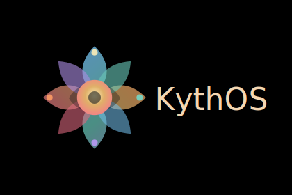

<div align="center">



# KythOS

### A fast, atomic image for gaming, creating, hacking, and everyday desktop life.

[](https://github.com/mrtrick37/kyth/actions/workflows/build.yml)
[](https://github.com/mrtrick37/kyth/actions/workflows/build-live-iso.yml)
[](https://github.com/mrtrick37/kyth/pkgs/container/kyth)
[](https://fedoraproject.org/atomic-desktops/kinoite/)
[](https://containers.github.io/bootc/)

[Download Stable ISO](https://github.com/mrtrick37/kyth/releases/tag/iso-latest) |
[Try Testing ISO](https://github.com/mrtrick37/kyth/releases/tag/iso-testing) |
[Read The Docs](#deep-dive) |
[Report A Bug](https://github.com/mrtrick37/kyth/issues)


</div>

KythOS is an opinionated desktop operating system built from a container image and installed from a live ISO. It starts with Fedora Kinoite and KDE Plasma, adds the CachyOS kernel, gaming and creator tooling, a custom installer, a first-run System Hub, and the kind of rollback story that makes experimenting less scary.

It is for people who want a Linux desktop that feels ready to play, stream, tinker, build, and recover without rebuilding their life every time a driver or game launcher gets dramatic.

## Try It

| Channel | Best for | Download |
|---|---|---|
| `latest` | Daily use | [Stable ISO release](https://github.com/mrtrick37/kyth/releases/tag/iso-latest) |
| `testing` | New features, active development, helping catch breakage | [Testing ISO release](https://github.com/mrtrick37/kyth/releases/tag/iso-testing) |

Direct ISO links:

- Stable: [kyth-live-latest.iso](https://pub-9a3cc72972ea44c4ae7504ee7cda1fa6.r2.dev/kyth-live-latest.iso)
- Testing: [kyth-live-testing.iso](https://pub-9a3cc72972ea44c4ae7504ee7cda1fa6.r2.dev/kyth-live-testing.iso)
- Checksums, signatures, bundles, and metadata are linked from each GitHub release.

**Live ISO requirements:** 8 GB RAM minimum and an active network connection. The installer pulls the OS image from GitHub Container Registry during install.

## The Pitch

| Play | Create | Build | Recover |
|---|---|---|---|
| Steam, Lutris, Heroic, GE-Proton, Gamescope, MangoHud, vkBasalt, GameMode, NTSYNC, sched-ext, controller rules, and Windows game migration helpers. | OBS, Kdenlive, Audacity, GIMP, OpenDeck, DaVinci Resolve helper, codec stack, PipeWire low-latency defaults, and vkcapture support. | VS Code, GitHub CLI, Docker, Homebrew, Distrobox, libvirt/QEMU, Incus/LXC, and a ready-made KythOS dev box. | Immutable base, atomic updates, GRUB fallback deployments, one-command rollback, signed images, SBOMs, and provenance. |

## First Boot

The live ISO drops you into KDE Plasma as `liveuser`. Click **Install KythOS**, choose whether to erase a disk or install alongside another OS, set your user account, and let `bootc install to-disk` write the image.

After reboot, **KythOS System Hub** opens automatically. It is the control room for updates, hardware checks, firmware, gaming setup, creator apps, VPN, cloud storage, repair tools, NVIDIA setup, Kali toolbox containers, and optional extras.

```text
Boot USB
  -> Install KythOS
  -> Reboot
  -> System Hub
  -> Play, create, build, break things safely
```

## What Makes It Feel Different

- **Atomic by default:** system updates stage as a new deployment, while the previous one remains bootable from GRUB.
- **Gaming-biased tuning:** CachyOS kernel, BORE scheduler, sched-ext controls, NTSYNC, GameMode profiles, MangoHud defaults, vkBasalt sharpening, FSR variables, and reduced desktop stutter paths.
- **Friendly to Windows refugees:** game readiness checks, save backup guidance, game-drive migration notes, ProtonDB and anti-cheat references, and non-destructive "Fix My Game" style actions in System Hub.
- **Creator-ready:** OBS capture paths, DaVinci Resolve packaging helper, media codecs, thumbnails, low-latency audio, and common creative apps a click away.
- **Mutable where it matters:** Flatpak, Homebrew, Distrobox, and containers handle apps and tools without polluting the base OS image.
- **Security tools without clutter:** Kali Linux lives in an optional Distrobox, not baked into the immutable desktop.
- **No surprise reboots:** automatic OS updates are disabled. You decide when to stage and reboot.

## System Hub

<div align="center">

</div>

KythOS System Hub is the thing you open when you do not want to remember a dozen commands.

| Section | What it helps with |
|---|---|
| Home | First-run wizard, branch selection, hardware check, firmware check, gaming setup |
| Update | Run `bootc upgrade`, view staged deployment status, switch branches |
| Hardware | GPU probe, system info, firmware and driver status |
| Gaming | Launchers, GE-Proton, MangoHud, vkBasalt, game checks, save tools, migration helpers |
| Creation | OBS, Kdenlive, Audacity, GIMP, OpenDeck, DaVinci Resolve helper |
| Security | Kali Distrobox tiers and optional security Flatpaks |
| Software | Flatpak, Homebrew, Distrobox, and common installs |
| Network | VPN Connect, GlobalProtect SAML flow, SMB shares, cloud storage through rclone |
| Repair | SELinux relabel, Flatpak repair, diagnostics |

## Install Paths

### Live ISO

1. Flash the ISO with `dd`, Balena Etcher, Ventoy, or your favorite USB writer.
2. Boot it. KDE Plasma autologins as `liveuser`.
3. Click **Install KythOS**.
4. Pick an install mode:
   - **Erase disk:** wipe the selected disk and install KythOS.
   - **Install alongside:** shrink the largest existing partition and install KythOS in the freed space.
5. Configure disk, timezone, hostname, and user account.
6. Click **Install**. The installer pulls the OS image and writes it with `bootc install to-disk`.
7. Reboot into KythOS.

### Existing Blank Partition

From the live ISO, install into a partition you already created:

```bash
sudo kyth-partition-install /dev/nvme0n1p5
```

Pass an EFI System Partition explicitly if needed:

```bash
sudo kyth-partition-install /dev/nvme0n1p5 /dev/nvme0n1p1
```

### Existing Fedora Atomic System

```bash
sudo bootc switch ghcr.io/mrtrick37/kyth:latest
```

Switch to testing later:

```bash
sudo bootc switch ghcr.io/mrtrick37/kyth:testing
```

## Updates And Rollback

```bash
sudo bootc upgrade
```

Updates are atomic. The running system is not mutated in place, and the previous deployment remains available from GRUB. Applications should generally come from Flatpak, Homebrew, Distrobox, or project containers.

## Deep Dive

<details>
<summary><strong>Core stack</strong></summary>

| Layer | Choice |
|---|---|
| Base | Fedora 44 KDE Plasma, `ublue-os/kinoite-main:44` |
| Kernel | CachyOS kernel with BORE scheduler, sched-ext, BBRv3, NTSYNC, latency tuning |
| Desktop | KDE Plasma 6 |
| Display | Wayland by default, with X11 live-session compatibility where needed |
| Installer | Custom PySide6 + Chromium kiosk using `bootc install to-disk` |
| Theme | Breeze Dark with KythOS branding, wallpaper, icon mark, and Plymouth splash |
| Security | SELinux enforcing, relabel services for bootc/ostree deployments |
| Image | `ghcr.io/mrtrick37/kyth:latest` and `ghcr.io/mrtrick37/kyth:testing` |

</details>

<details>
<summary><strong>Gaming loadout</strong></summary>

- Steam, Lutris, Heroic Games Launcher, ProtonUp-Qt, protontricks, GE-Proton, umu-launcher, winetricks, and libFAudio.
- GameMode, Gamescope, MangoHud, vkBasalt, LatencyFleX, obs-vkcapture, scx schedulers, system76-scheduler, and ananicy-cpp.
- Controller and peripheral stack: steam-devices, game-devices rules, xpadneo/xone, OpenRazer, OpenTabletDriver, Piper, OpenRGB, and input-remapper.
- Helper commands: `kyth-gamescope`, `game-performance`, `kyth-performance-mode`, `zink-run`, `kyth-kerver`, and `kyth-device-info`.
- Guides: [gaming validation matrix](docs/gaming-validation-matrix.md), [modding](docs/modding-on-kythos.md), [save migration](docs/game-save-migration.md), [developer support checklist](docs/developer-linux-support-checklist.md), and [why games work better here](docs/works-better-here.md).

</details>

<details>
<summary><strong>Creator, developer, and network tools</strong></summary>

- Creator apps: OBS Studio, Kdenlive, Audacity, GIMP, OpenDeck, DaVinci Resolve helper, mpv, ffmpeg, GStreamer plugins, OpenH264, ffmpegthumbnailer, and low-latency PipeWire defaults.
- Developer tools: VS Code, GitHub CLI, Homebrew, topgrade, Docker, Distrobox, libvirt/QEMU, Incus/LXC, NVIDIA kernel module support, and KDE Connect.
- Network tools: standalone VPN Connect app, OpenConnect protocols, GlobalProtect SAML support, tray status helper, SMB/CIFS setup, and rclone cloud storage setup.
- Security tools: optional Kali Linux Distrobox tiers plus optional Wireshark and Burp Suite Flatpaks.

</details>

<details>
<summary><strong>System tuning highlights</strong></summary>

- zram with zstd compression, swappiness tuned for zram, THP set to `madvise`, high `vm.max_map_count`, fast OOM recovery, and capped dirty pages.
- TCP BBRv3, larger socket buffers, TCP Fast Open, MTU probing, and raised inotify limits.
- Storage scheduler by device type, weekly `fstrim.timer`, optional weekly `duperemove`, and journald caps.
- Wine/Proton defaults for NTSYNC, fsync/esync fallbacks, DXR, VKD3D feature level 12_2, RADV GPL, Mesa GL threading, and NVIDIA NVAPI/threaded optimizations when relevant.
- KDE Baloo disabled by default to reduce I/O churn after large game downloads.

</details>

<details>
<summary><strong>Build locally</strong></summary>

Requirements: `docker` and `just`.

```bash
just build-base
just build
just build-live-iso
just run-live-iso-native
```

Useful recipes:

```bash
just build-base
just build
just build-live-iso
just build-live-iso testing
just rebuild-live-iso
just run-live-iso
just run-live-iso-native
just build-qcow2
just disk-usage
just clean
just clean-docker
just lint && just format
```

`just build` produces `localhost/kyth:latest`. The live ISO lands at `output/live-iso/kyth-live-latest.iso`.

Feature flags:

```bash
ENABLE_ANANICY=0 ENABLE_SCX=0 just build
```

</details>

<details>
<summary><strong>Repository map</strong></summary>

```text
Dockerfile                        Main OS image
Justfile                          Build orchestration

build_base/                       Fedora Kinoite base plus CachyOS kernel
build_files/
  build-live-iso.sh               Live ISO assembler
  Containerfile.live              Live session image
  kyth-installer                  Graphical installer
  kyth-install.sh                 bootc disk installer
  kyth-partition-install.sh       Existing-partition installer
  branding/                       Logo, transparent mark, installer CSS
  wallpaper/                      KythOS wallpaper
  scripts/                        Package, tuning, branding, third-party setup
  kyth-welcome/                   KythOS System Hub
  kyth-vpn-connect/               Standalone OpenConnect VPN app
  kyth-vpn-status/                KDE VPN tray helper
  just/kyth.just                  ujust recipes shipped in the OS

disk_config/                      Bootc Image Builder configs
.github/workflows/                Image, ISO, lint, scorecard, supply chain
docs/                             Gaming, migration, modding, validation docs
```

</details>

## Verification

Container images are signed with keyless Sigstore/Cosign, include attached Syft SBOMs in GHCR, and publish GitHub build provenance attestations. Live ISO releases publish the ISO, SHA256 checksum, Cosign signature, Cosign bundle, JSON metadata, and provenance.

## Links

- [Issues](https://github.com/mrtrick37/kyth/issues)
- [Discussions](https://github.com/mrtrick37/kyth/discussions)
- [Actions](https://github.com/mrtrick37/kyth/actions)
- [Container package](https://github.com/mrtrick37/kyth/pkgs/container/kyth)

<div align="center">

**KythOS is not affiliated with Fedora, Universal Blue, CachyOS, Valve, or KDE. It just really likes their work.**

</div>

<!-- AUTO-README-START -->
## Auto Project Snapshot

- Last refreshed (UTC): 2026-05-19 23:50:14 UTC
- Current branch: testing
- HEAD commit: 536d2f5
- Last commit title: once again around the secure boot bush
- Last commit date: 2026-05-19T15:24:35-04:00
- CI workflow files: 5
- Build script files: 8

<!-- AUTO-README-END -->
